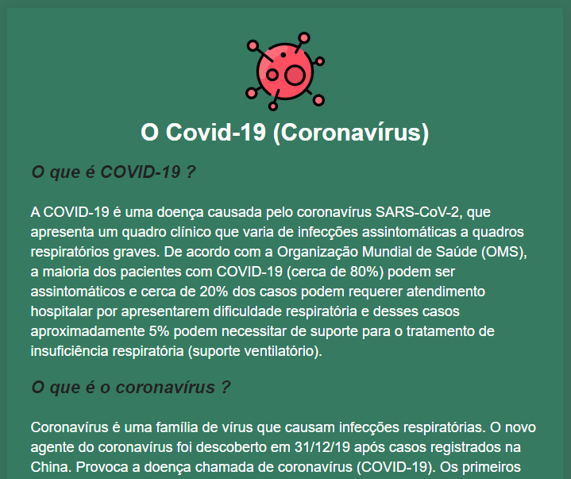
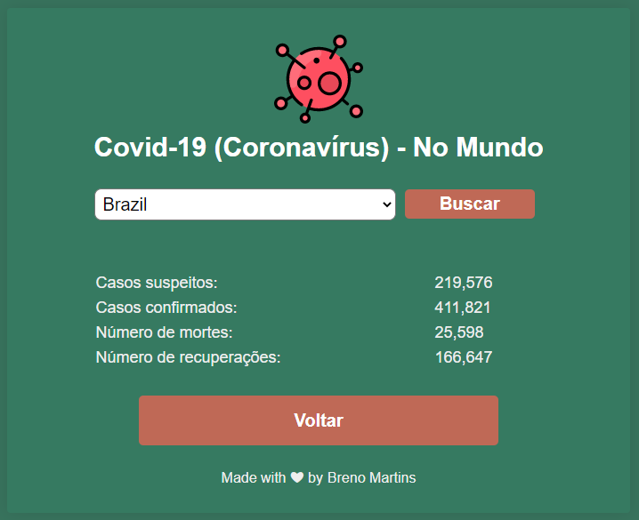

[![LinkedIn][linkedin-shield]][linkedin-url]

<!-- PROJECT LOGO -->
 

  <h3 align="center">Acompanhe o Covid-19 no Brasil e no Mundo</h3>

  

    Acompanhe a situação do novo Coronavírus (Covid-19) no Brasil (busca por estado) e no Mundo (busca por países).
     
    <a href="https://github.com/sbrenomartins/acompanheocovid"><strong>Explore the docs »</strong></a>
     
     
    <a href="https://github.com/sbrenomartins/acompanheocovid">View Demo</a>
    ·
    <a href="https://github.com/sbrenomartins/acompanheocovid/issues">Report Bug</a>
    ·
    <a href="https://github.com/sbrenomartins/acompanheocovid/issues">Request Feature</a>
  

  
  

    
    
    
    
  

<!-- TABLE OF CONTENTS -->
## Table of Contents ⚙

* [About the Project](#about-the-project)
  * [Built With](#built-with)
* [Getting Started](#getting-started)
  * [Prerequisites](#prerequisites)
* [Usage](#usage)
* [Roadmap](#roadmap)
* [Contributing](#contributing)
* [Contact](#contact)

<!-- ABOUT THE PROJECT -->
# About The Project 🔥

## Built With 👷‍♀️

* [React](https://pt-br.reactjs.org/)
* [styled-components](https://www.styled-components.com/)
* [font-awesome](https://fontawesome.com/)
* [axios](https://github.com/axios/axios)
* [react-router-dom](https://www.npmjs.com/package/react-router-dom)
* [react-loadingg](https://reactjsexample.com/build-a-smooth-and-lightweight-react-component-loading-with-css/)
* [react-number-format](https://www.npmjs.com/package/react-number-format)

### References

* [API de consulta](https://covid19-brazil-api-docs.now.sh/)
* [https://coronavirus.saude.gov.br/sobre-a-doenca](https://coronavirus.saude.gov.br/sobre-a-doenca)

## Getting Started 🚀

### Prerequisites 

- You need to have Node.js and NPM (or Yarn) installed. 
- After clone the project just run: npm install or yarn, for install the dependencies.
- After install the dependencies, just run: npm start or yarn start for initialize the server.

<!-- ROADMAP -->
## Roadmap 🏁

See the [open issues](https://github.com/github_username/repo/issues) for a list of proposed features (and known issues).

<!-- CONTRIBUTING -->
## Contributing 🙋‍♀️

Contributions are what make the open source community such an amazing place to be learn, inspire, and create. Any contributions you make are **greatly appreciated**.

1. Fork the Project
2. Create your Feature Branch (`git checkout -b feature/AmazingFeature`)
3. Commit your Changes (`git commit -m 'Add some AmazingFeature'`)
4. Push to the Branch (`git push origin feature/AmazingFeature`)
5. Open a Pull Request

<!-- CONTACT -->
## Contact 📱

Breno Martins - sbrenomartins.github.io - sbrenomartins@gmail.com

Project Link: [https://github.com/sbrenomartins/imc_calculator](https://github.com/sbrenomartins/imc_calculator)

<!-- MARKDOWN LINKS & IMAGES -->
<!-- https://www.markdownguide.org/basic-syntax/#reference-style-links -->
[linkedin-shield]: https://img.shields.io/badge/-LinkedIn-black.svg?style=flat-square&logo=linkedin&colorB=555
[linkedin-url]: https://linkedin.com/in/breno-m-silva
